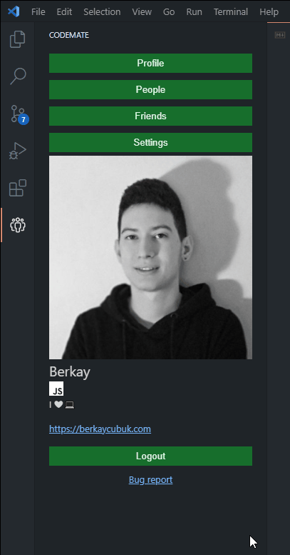

# Codemate
Connect with developers around the world!

## Quick start
- **Step 1** => Login with Github
- **Step 2** => Go to settings and customize your profile
- **Step 3** => Go to people page and start connecting with people!

## Features
- Login with Github
- Profile page
- Connections. Connect with other developers
- Settings. Customize your profile

## Bug reports, feature requests and contributions
If you have something to share, you can use [github issues](https://github.com/berkaycubuk/codemate/issues)